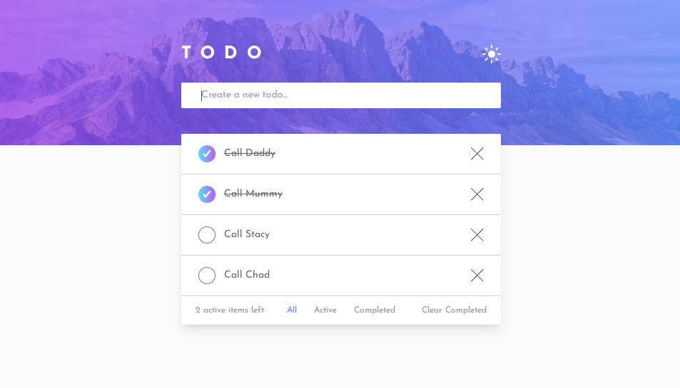

# Frontend Mentor - Todo app solution

This is a solution to the [Todo app challenge on Frontend Mentor](https://www.frontendmentor.io/challenges/todo-app-Su1_KokOW). Frontend Mentor challenges help me improve my coding skills by building realistic projects. 

## Table of contents

- [Overview](#overview)
  - [The challenge](#the-challenge)
  - [Screenshot](#screenshot)
  - [Links](#links)
- [My process](#my-process)
  - [Built with](#built-with)
  - [What I learned](#what-i-learned)
  - [Continued development](#continued-development)
  - [Useful resources](#useful-resources)
- [Author](#author)
- [Acknowledgments](#acknowledgments)

**Note: Delete this note and update the table of contents based on what sections you keep.**

## Overview

### The challenge

Users should be able to:

-✅ View the optimal layout for the app depending on their device's screen size
-✅ See hover states for all interactive elements on the page
-✅ Add new todos to the list
-✅ Mark todos as complete
-✅ Delete todos from the list
-✅ Filter by all/active/complete todos
-✅ Clear all completed todos
-✅ Toggle light and dark mode
-✅ **Bonus**: Drag and drop to reorder items on the list

### Screenshot

### Links

- Solution URL: [My future solution](https://github.com/tania0808/todo-app#the-challenge)
- Live Site URL: [AMy future live site]()

## My process

### Built with

- [React](https://reactjs.org/) - JS library, create-react-app
- [Tailwind CSS](https://tailwindcss.com/) - For styles
- [Drag and Drop](https://egghead.io/courses/beautiful-and-accessible-drag-and-drop-with-react-beautiful-dnd) -Beautiful and Accessible Drag and Drop with react-beautiful-dnd
- [DnD tutorial](https://www.youtube.com/watch?v=aYZRRyukuIw) - Tutorial how to add Drag and Drop in React
### What I learned
- Redux State handling
- Tailwind Css classes

### Continued development

- Redux
- React testing
- TypeScript

### Useful resources

- [Set up Tailwind with React](https://tailwindcss.com/docs/guides/create-react-app) - Tailwind CSS installation

## Author

- Website - [Tania](https://portfolio-tania-his.netlify.app/)
- Linkedin - [Tetiana His](https://www.linkedin.com/in/tetiana-his/)
- Github - [@tania0808](https://github.com/tania0808/)

